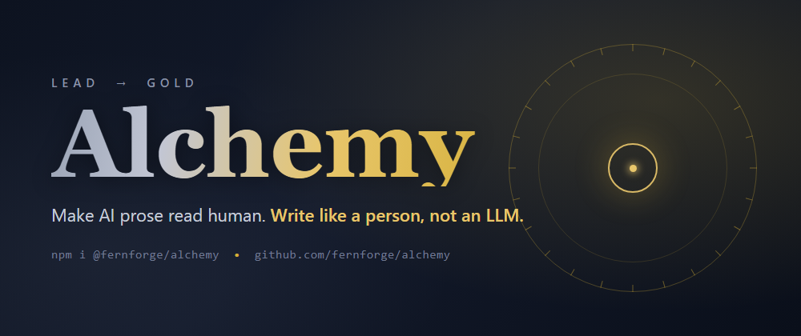

<p align="center">
  
</p>

# Alchemy

Turn lead into gold: AI prose into writing that reads like a person wrote it.

Hand this ruleset to your coding agent (Claude Code, Cursor, Copilot, any LLM) and the
docs, READMEs, commit messages, and replies it writes stop carrying the usual generated-text
tells. You know the ones. The em-dash in every other sentence. "It's not just a tool, it's a
workflow." The stray *delve* and *robust* and *seamless*. The conclusion that restates the
intro and adds nothing.

The whole thing is one file: [`ALCHEMY.md`](./ALCHEMY.md). Everything else just gets it into
your project.

## Install

Pick whichever fits your stack. They all deliver the same rules.

**Node / npx:**

```bash
npx @fernforge/alchemy init
```

That writes `ALCHEMY.md` and links it from your `CLAUDE.md`, `AGENTS.md`, `.cursorrules`, or
Copilot instructions if you have one. `npx @fernforge/alchemy print` just prints them.

**Python / pip:**

```bash
pip install alchemy-writing
alchemy init
```

Same `init` and `print` commands. You can also read the rules in code with
`alchemy_writing.rules()`.

**MCP server** — for agents that should pull the rules on demand across every project, with no
file to copy. Add to your client config (Claude Desktop, Cursor, Cline):

```json
{
  "mcpServers": {
    "alchemy": { "command": "npx", "args": ["-y", "@fernforge/alchemy-mcp"] }
  }
}
```

It serves a `get_writing_rules` tool and an `alchemy://rules` resource. See
[`mcp/`](./mcp) for details.

**Or just the file.** Copy [`ALCHEMY.md`](./ALCHEMY.md) into wherever your tool reads project
instructions. It's plain Markdown and tied to no particular agent.

## What's in it

The rules are grounded in what people actually flag as AI writing, not guesses: Wikipedia's
"Signs of AI writing," the Kobak et al. study measuring which words spiked in research papers
after ChatGPT, Pangram's phrase-frequency data, and the long-running arguments on Reddit and
in r/Professors about spotting it.

They cover the banned constructions ("not just X, but Y," the rule-of-three flourish, the
helpful-assistant outro), the vocabulary that fingerprints LLM text, the punctuation tells led
by em-dash overuse, vague attribution, and a self-check the agent runs over its own prose
before handing it back.

One rule sits above the rest: no single word or dash proves anything. The tell is density,
the same handful of tics clustered together over flat, evenly-weighted text. So the rules
weight co-occurrence over any one hit, and they never tell you to cut a word that happens to
be the right one.

This README follows its own rules. If it reads fine, that's the pitch.

## Why "Alchemy"

Alchemists tried to turn base metal into gold and never managed it. This is the easier
version of the trick, and it mostly works by subtraction: cutting the padding the model adds
by default until what's left could pass for human.

The goal was never to beat an AI detector. It's to write something worth reading. Specific,
uneven, willing to have a point of view. A fooled detector is a side effect.

## Contributing

Found a tic the rules miss? Open an issue or a PR with a real before/after example. Keep it
concrete. The rules earn their place by being specific, not by being long.

Edit the root [`ALCHEMY.md`](./ALCHEMY.md) only. The copies under `python/` and `mcp/` are
generated from it by `node scripts/sync-rules.mjs`, and CI fails if they drift. The npm, PyPI,
and MCP packages publish from GitHub Releases (see [`.github/workflows`](./.github/workflows)).

## License

MIT
